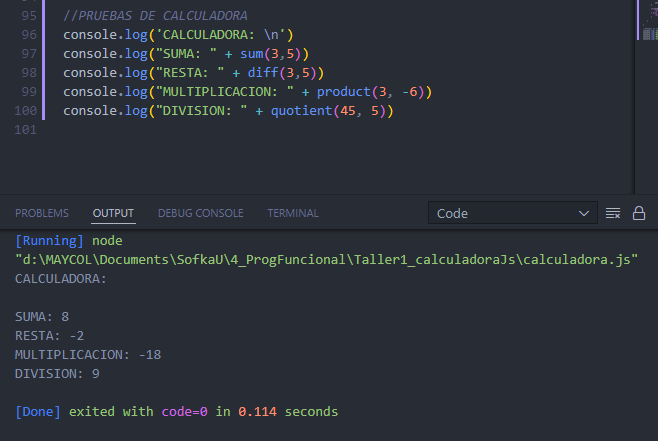

# Taller Funcional - calculadora

**_Maycol Steven Rincon Bayona_**

Taller de programación funcional en javascript. Reto: realizar una calculadora con solo sumas y restas

Se aplicacion los conceptos aprendidos en el módulo de programación funcional

Imagen de prueba del código:  

Feliz día.
